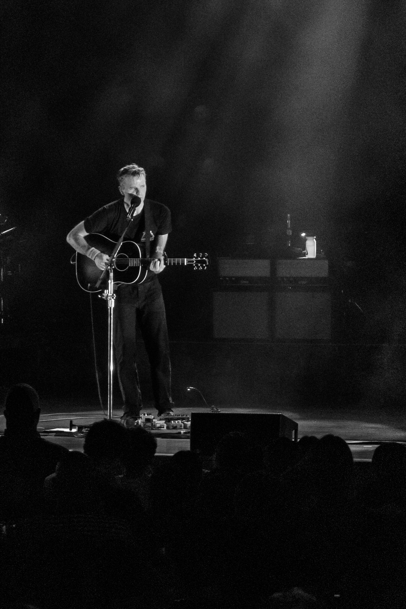

My strongest first impression was how incredibly tight the band was — and how
much more complex these songs are than the recordings let on. Many have band
members playing multiple instruments, switching off between guitar and keys, and
a lot of them carry three distinct guitar parts. It takes a great band to
replicate that live, and they did.

<!--more-->

## The performance

The sky opened up. Rain poured through most of the set, and I was grateful to be
under the pavilion — though the wind kept driving it in sideways and we still got
wet. A crazy storm.

Something about the music and the weather together made me nostalgic for the
early days with my wife. That spring was extraordinarily wet, and the rain that
night pulled those months right back to the surface. Seeing Death Cab sent me
straight to the Postal Service on the drive home, and it rained like hell the
whole way — I was flooded with memories of my first few months with Mrs. TKD.

Between the day we met and July 15th, it rained 49 out of 95 days, and it was
colder than normal. I still carry the specific pictures: picking her up on rainy
nights, both of us in wool sweaters and jeans. So here is my deep thought,
arrived at under that downpour — music and rain dominated our first 95 days
together.

## Highlights

Japanese Breakfast opened, and Michelle Zauner absolutely rocked it — a strong,
high-energy set that set the tone for the night.

A highlight of the show was Ben Gibbard alone at center stage for "I Will Follow
You Into the Dark" — just him and an acoustic guitar. An incredible song about
love and death, and the whole pavilion went quiet for it.

## Japanese Breakfast setlist

*Intro: Planetary Ambience*

1. Paprika
2. Honey Water
3. Road Head
4. Picture Window
5. Boyish *(Little Big League cover)*
6. The Body Is a Blade
7. Mega Circuit
8. Kokomo, IN
9. Slide Tackle
10. Be Sweet
11. Diving Woman

## Death Cab for Cutie setlist

1. Riptides
2. Roman Candles
3. The New Year
4. Punching the Flowers
5. The Ghosts of Beverly Drive
6. Black Sun
7. I Built You a Tower
8. Company Calls
9. Pep Talk
10. Codes and Keys
11. I Will Possess Your Heart
12. I Will Follow You Into the Dark *(Ben solo, acoustic guitar)*
13. Stone Over Water
14. How Heavenly a State
15. Cath...
16. Crooked Teeth
17. Trap Door
18. You Are a Tourist
19. The Sound of Settling
20. Soul Meets Body

### Encore

21. Title Track
22. Here to Forever
23. Marching Bands of Manhattan
24. Transatlanticism

## Setlist notes

<!-- Put photographs in this page's folder and use:  -->
